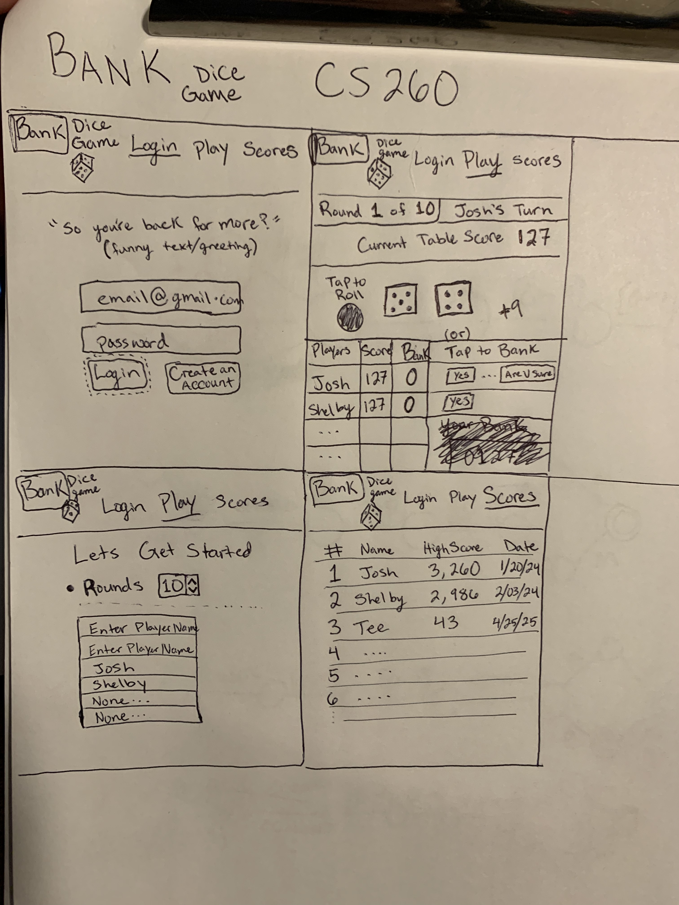

# **BANK** *dice* *game*

### Elevator pitch: 
    Want to destroy your friends in a game of dice? Well, look no further! Bank is a popular game of chance and probability where each player tries to "Bank" the most points. In this pass-and-play game, each player can tap out at any time. tap out too soon and you won't gain many points and if you wait too long you could lose it all! 

### Key Features
    + Login provides users with customizations to personalize their account
    + The screen will display humorous comments when logging in and when rolling the dice.
    + Play Solo or Add up to 6 players in a game
    + Choose how many rounds you want to play (up to 10 rounds)
    + The app will keep track of the Rounds, the current table score, and the Bank score of each player round to round. The players will not have to do any calculations or keep score.
    + Rolling the dice is simple, just press the Big Geen Button to take a chance.
    + Each player can choose to tap a button to "Bank" and "cash out" the table score into their personal Bank score before any player rolls the dice.
    + When a winner is declared each player's score will be displayed on the leaderboard for all to see. It will rank them among all other previous players.   
    
### Technologies    

    + HTML - will be used for the basic structural elements of the app, like the different option tabs. The main framework.
    + CSS - will be used for styling the words and animating the dice roll, and pop-up phrases. 
    + JavaScript - will be used to interact with the game and play, such as when buttons are pressed, totaling scores, and other logical functionality used.
    + Web service - will be used to connect remotely to a web service to save the scores.
    + Authentication - will be used for logging in and creating new accounts.
    + Database persistence - will be used to save the scores of players in a database as well as login information
    + WebSocket - will be used to connect to the web to show current record holders in the high score tab of the game.

### Images
    
   

   Notes:
        Monday, Feb 5th, 2024 "HTML" I was able to implement the header of each of the files and link them together. 
        I created boxes, tables, and buttons that I will later implement in the continuing stages of development. 
        I set up the skeleton for the gameplay The previous assignments we did were super helpful. I found myself using those as a reference to help make the skeleton of this program. 
        I had a hard time finding an image that would actually work. When I used a stock photo it seemed to work. 
        While doing this project I have learned a lot more about the basic structure of how HTML works. I'm excited to learn how to implement CSS and JavaScript.
        To implement web Sockets I will be updating the score in real time. 
        Data will be stored in the score page as well
        I will use a web service to implement the roll dice part of play
### CSS Startup Notes
        Thursday Feb 15th, 2024   "CSS" 
                I was able to incorporate some classes into my html and apply them in css. Through that process, I learned that it is important to use the correct declarations of classes within a 
 or an <a> or some other thing. I was able to use FLEX to each part of the page to get it to re-align depending on the size. I learned to align my Title in the center and how to get my page to have a named title when you hover over the web Page. I learned to change the color of text and the backgroud to what ever I found appealing. It was difficult at first but I was able to align the navigation to the left size and space it from the name of the page. 
        
        
